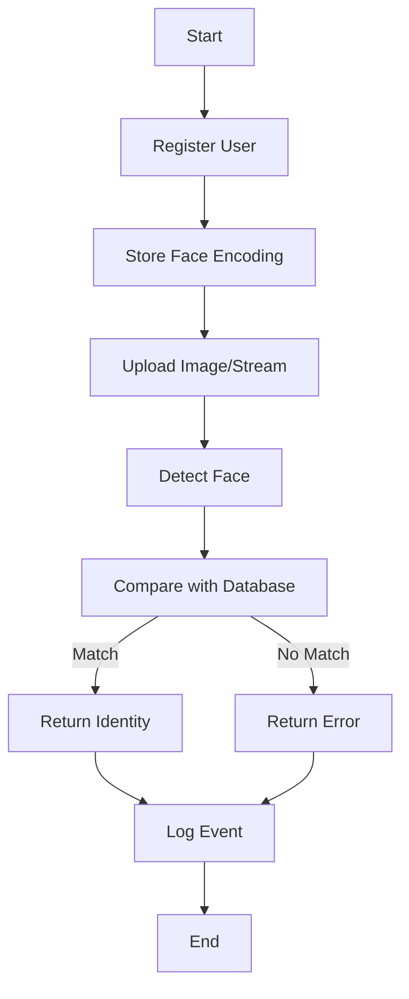

# Face-Recognition

A powerful and accessible face recognition platform built for real-time applications, such as attendance systems, security monitoring, and access control. This project offers robust face detection and recognition capabilities using state-of-the-art models and simple APIs, enabling easy integration with various applications and systems.

---

## Introduction

Face-Recognition is a Python-based application that leverages machine learning and computer vision techniques to detect and recognize human faces from images or video streams. Designed for flexibility, this project can be used for attendance tracking, authentication, or surveillance in educational, corporate, or public settings. It includes a web interface for user interaction and RESTful APIs for programmatic access.

---

## Features

- Real-time face detection and recognition using deep learning models.
- Web-based interface for interactive management and visualization.
- Support for image uploads and live video streams.
- User management, including face registration and deletion.
- Attendance tracking and logging.
- Easy-to-read logs and error handling.
- Modular codebase for customization and extension.
- Dependency management with requirements file.
- Ready-to-deploy with minimal configuration.

## Usage

This section describes how to set up, run, and interact with the Face-Recognition application.

### 1. Clone the Repository

```bash
git clone https://github.com/RakeshV2004/Face-Recognition.git
cd Face-Recognition
```

### 3. Prepare Dataset

- Place reference images for each person in a dedicated folder (e.g., `dataset/Person_Name/`).
- Ensure clear, front-facing images for best accuracy.


### 5. Register New Faces

- Use the web UI to upload new face images and assign them to users.
- Alternatively, use the API to register faces.

### 6. Recognize Faces

- Upload an image or start a video stream via the UI or API.
- The app will detect faces, compare them with the database, and return results.

### Typical Workflow

#### Step-by-Step Process

1. **Register Users**
   - Upload clear, front-facing photos for each user via UI or API.
2. **Recognition**
   - Submit images or use webcam for recognition.
   - Receive identification results or errors.
3. **Attendance and Logs**
   - System logs attendance or recognition events.
   - Download or review logs as needed.

#### System Flow Overview



---

## Additional Notes

- For best results, ensure consistent lighting and camera angles.
- You can extend the system for video surveillance, automated attendance, or multi-factor authentication.
- Refer to the codebase for detailed function documentation and extension points.

---

## Contributing

We welcome contributions! Please fork the repository, create a branch, and submit pull requests for bug fixes or new features.

---

## License

This project is open-source and available under the MIT License. See the `LICENSE` file for more details.

---

## Contact

For questions, suggestions, or support, open an issue on GitHub or contact the repository maintainer.

---

Enjoy building with Face-Recognition!
